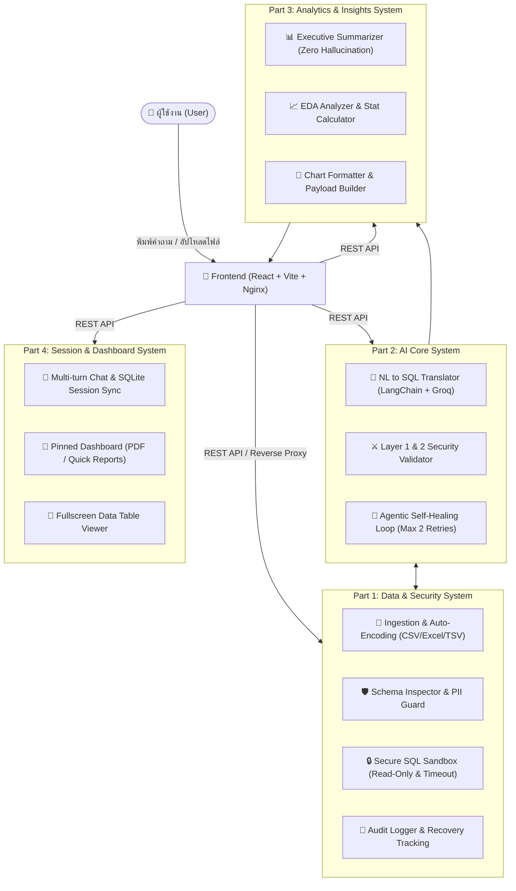

# 🤖 Text-to-SQL AI Agent (Team 04)

> **ระบบผู้ช่วยวิเคราะห์ข้อมูลอัจฉริยะด้วยภาษาธรรมชาติและสถิติเชิงลึก (Intelligent Natural Language to SQL & Automated Analytics Agent)**

[](https://www.python.org/)
[](https://fastapi.tiangolo.com/)
[](https://react.dev/)
[-success.svg)](https://pytest.org/)
[](LICENSE)

---

## 📖 สารบัญ (Table of Contents)
- [ภาพรวมของโครงงาน (Overview)](#-ภาพรวมของโครงงาน-overview)
- [สถาปัตยกรรมระบบ 4 ส่วนหลัก (System Architecture)](#-สถาปัตยกรรมระบบ-4-ส่วนหลัก-system-architecture)
- [คุณสมบัติเด่นของระบบ (Key Features)](#-คุณสมบัติเด่นของระบบ-key-features)
- [เทคโนโลยีที่ใช้พัฒนา (Tech Stack)](#-เทคโนโลยีที่ใช้พัฒนา-tech-stack)
- [โครงสร้างโฟลเดอร์ (Directory Structure)](#-โครงสร้างโฟลเดอร์-directory-structure)
- [การติดตั้งและเริ่มต้นใช้งาน (Getting Started)](#-การติดตั้งและเริ่มต้นใช้งาน-getting-started)
  - [วิธีที่ 1: รันด้วย Docker Compose (แนะนำสำหรับการขึ้นระบบ)](#วิธีที่-1-รันด้วย-docker-compose-แนะนำ)
  - [วิธีที่ 2: รันแบบแยกเครื่องพัฒนา (Local Development)](#วิธีที่-2-รันแบบแยกเครื่องพัฒนา-local-development)
- [การตั้งค่าตัวแปรสภาพแวดล้อม (Environment Variables)](#-การตั้งค่าตัวแปรสภาพแวดล้อม-environment-variables)
- [การทดสอบระบบ (Testing & Quality Assurance)](#-การทดสอบระบบ-testing--quality-assurance)

---

## 🎯 ภาพรวมของโครงงาน (Overview)

**DataAgent AI (Team 04)** เป็นระบบ AI Agent สำหรับการวิเคราะห์ข้อมูลและสร้างรายงานสรุปเชิงสถิติอัตโนมัติ ผู้ใช้งานสามารถนำเข้าชุดข้อมูล (CSV, TSV, TXT, Excel .xlsx/.xls) และพิมพ์คำถามด้วยภาษาไทยหรือภาษาอังกฤษทั่วไป ระบบจะทำการ:
1. วิเคราะห์เจตนาและแปลคำถามเป็นคำสั่ง **SQL (Text-to-SQL)** ที่สอดคล้องกับโครงสร้างข้อมูลจริง
2. ตรวจสอบความปลอดภัย 4 ชั้น (Defense-in-Depth) และประมวลผลคำสั่งในสภาพแวดล้อมจำลอง (Secure Sandbox) พร้อมระบบซ่อมแซมคำสั่งอัตโนมัติ (**Agentic Self-Healing Loop**)
3. คำนวณสถิติและสร้าง **ข้อสรุปภาษาไทยสำหรับผู้บริหาร (Executive Insights)** แบบไร้การคาดเดา (Zero Hallucination)
4. แนะนำและเรนเดอร์ **แผนภูมิสถิติอัตโนมัติ (Bar, Line, Area, Pie Chart)** พร้อมทั้งส่งออกเป็นภาพความละเอียดสูงระดับ 2x Retina และไฟล์สเปรดชีต CSV ได้ทันที

---

## 🏗 สถาปัตยกรรมระบบ 4 ส่วนหลัก (System Architecture)



---

## ✨ คุณสมบัติเด่นของระบบ (Key Features)

### 1. การนำเข้าข้อมูลอัจฉริยะ (Smart Data Ingestion)
- รองรับไฟล์หลากหลายนามสกุล: `.csv`, `.tsv`, `.txt`, `.xlsx`, `.xls`
- ตรวจจับชุดรหัสตัวอักษรอัตโนมัติ (Auto-Encoding Detection): `UTF-8`, `CP874`, `TIS-620`, `Windows-1252` ป้องกันสระและวรรณยุกต์ภาษาไทยเพี้ยนจาก Microsoft Excel
- ตรวจจับชนิดข้อมูลอัตโนมัติ (Data Type Inference): `INTEGER`, `REAL`, `DATE (ISO YYYY-MM-DD)`, `TEXT`
- ระบบแจ้งเตือนข้อมูลส่วนบุคคล (PDPA / PII Warning): ตรวจจับเลขบัตรประจำตัวประชาชน (13 หลัก), หมายเลขโทรศัพท์ และที่อยู่อีเมล

### 2. ความปลอดภัยระดับสูง 4 ชั้น (4-Layer Defense-in-Depth)
- **Layer 1: Input Pre-validation** — สกัดกั้นคำสั่งอันตราย (DROP, DELETE, UPDATE, ALTER, TRUNCATE) ก่อนส่งให้ AI เพื่อประหยัด Token
- **Layer 2: AST & Regex Security Validator** — ตัด string literals และ comments ออกเพื่อป้องกันเทคนิค SQL Injection แบบซับซ้อน และอนุญาตเฉพาะคำสั่ง `SELECT` หรือ `WITH`
- **Layer 3: Engine-Level Read-Only Sandbox** — บังคับ `PRAGMA query_only = ON;` บน SQLite Connection ป้องกันการแก้ไขฐานข้อมูลที่ระดับเอนจิน
- **Layer 4: Execution Sandbox Limits** — จำกัดเวลาการประมวลผล (Timeout 10 วินาที), จำกัดแถวผลลัพธ์สูงสุด 500 แถว และบันทึกประวัติการเรียกใช้งาน (Audit Log) ทุกครั้ง

### 3. ระบบซ่อมแซมคำสั่งอัตโนมัติ (Agentic Self-Healing Loop)
- หากคำสั่ง SQL เกิด Syntax Error หรือระบุชื่อคอลัมน์ไม่ตรงกับ Schema ระบบจะส่ง Error Message กลับไปยัง AI เพื่อวิเคราะห์และแก้ไขคำสั่งใหม่อัตโนมัติสูงสุด 2 รอบ โดยที่ผู้ใช้ไม่ต้องพิมพ์สั่งใหม่

### 4. รายงานสรุปเชิงสถิติและแผนภูมิอัจฉริยะ (Executive Insights & Auto Charts)
- วิเคราะห์ข้อมูลเชิงสถิติ (ยอดรวม, ค่าเฉลี่ย, สูงสุด, ต่ำสุด) และสร้างบทสรุปภาษาไทยที่กระชับ เหมาะสำหรับผู้บริหาร
- แนะนำและสร้างกราฟอัตโนมัติด้วย Recharts (Bar Chart, Line Chart, Area Chart, Pie Chart) พร้อมระบบสลับมุมมองกราฟ
- ส่งออกกราฟเป็นไฟล์รูปภาพ PNG ความละเอียดสูงระดับ 2x Retina พร้อมระบุคำอธิบายสี (Legend) ครบถ้วน
- ระบบคำถามนำทางต่อเนื่องอัจฉริยะ (Smart Follow-up Questions) ทั้งข้อมูลเชิงปริมาณและเชิงคุณภาพ

### 5. แดชบอร์ดบันทึกผลและตารางข้อมูลเต็มหน้าจอ (Dashboard & Table Viewer)
- บันทึกประวัติการสนทนาแยกตามห้อง (Multi-turn Sessions) บน SQLite แบบถาวร
- ปักหมุดกราฟและรายงานสรุปที่สนใจลงบนหน้าปัดแดชบอร์ด (Pinned Dashboard) พร้อมปุ่มพิมพ์รายงาน (PDF)
- ตารางผลลัพธ์ข้อมูลรองรับการแบ่งหน้า (Pagination), เลือกจำนวนแถว (10/25/50/100/ทั้งหมด), ส่งออก CSV แบบ UTF-8 BOM สำหรับ Excel และขยายดูแบบเต็มจอ (Fullscreen)

---

## 🛠 เทคโนโลยีที่ใช้พัฒนา (Tech Stack)

| ส่วนงาน | เทคโนโลยีและเครื่องมือ |
|---|---|
| **Frontend** | React 18, Vite, Recharts, Lucide Icons, Axios, React Markdown, Remark GFM |
| **Backend** | Python 3.11-3.13, FastAPI, Uvicorn, SQLAlchemy, LangChain, Groq SDK |
| **AI / LLM** | Groq API (`openai/gpt-oss-20b`, `qwen/qwen3.6-27b`), Few-Shot SQL Prompting |
| **Database** | SQLite 3 (WAL Mode + Busy Timeout 5000ms เพื่อรองรับ Concurrent Queries) |
| **Data Processing** | OpenPyXL, XLRD, Native CSV with Encoding Fallback Dispatcher |
| **Deployment** | Docker, Docker Compose, Nginx (Reverse Proxy & SPA Static Server) |
| **Testing** | Pytest, Pytest-Asyncio, Oxlint |

---

## 📁 โครงสร้างโฟลเดอร์ (Directory Structure)

```text
team04-agentAI/
├── backend/
│   ├── app/
│   │   ├── api/                     # REST API Routers แยกตาม Part 1 - 4
│   │   │   ├── part1_router.py      # อัปโหลดไฟล์, Schema, Audit Logs, Datasets
│   │   │   ├── part2_router.py      # Pipeline หลัก (Query, Self-heal, Cache)
│   │   │   ├── part3_router.py      # Insights & Chart Recommendation
│   │   │   └── part4_router.py      # Sessions, Chat History, Pinned Items
│   │   ├── core/                    # การตั้งค่า (Config) และ Rate Limiter
│   │   ├── db/                      # SQLAlchemy Engine และ SQLite Configuration
│   │   ├── part1_data_security/     # CSV Uploader, Sandbox, Audit Logger
│   │   ├── part2_ai_core/           # NL Translator, Prompt Builder, Self-Corrector
│   │   ├── part3_analytics_insights/# Executive Summarizer, Stat Calculator, EDA
│   │   └── services/                # Groq LLM Connection Service
│   ├── tests/                       # ชุดทดสอบ Unit & Benchmark Tests (162 ข้อ)
│   ├── Dockerfile
│   ├── main.py                      # FastAPI Entrypoint & Lifespan Handler
│   └── requirements.txt
├── frontend/
│   ├── src/
│   │   ├── components/
│   │   │   ├── analytics/           # Analytics Panel (Chart, Table, Insights)
│   │   │   ├── charts/              # Recharts Renderer & High-Res PNG Exporter
│   │   │   ├── chat/                # Markdown Message, SQL Box, History Sidebar
│   │   │   ├── common/              # Toast Notification Stack
│   │   │   ├── data/                # DataTableViewer (Pagination & CSV Export)
│   │   │   └── upload/              # FileUploadModal & Dataset Manager
│   │   ├── services/                # Axios API Services (Chat, Upload, Dashboard)
│   │   ├── App.jsx                  # Main Application Component
│   │   └── App.css                  # Responsive Theme & UI Styling
│   ├── Dockerfile
│   ├── nginx.conf                   # Nginx Reverse Proxy & Client Routing
│   └── package.json
├── docker-compose.yml               # Multi-container Deployment Orchestration
├── .env.example                     # ไฟล์ตัวอย่าง Environment Variables
└── README.md
```

---

## 🚀 การติดตั้งและเริ่มต้นใช้งาน (Getting Started)

### วิธีที่ 1: รันด้วย Docker Compose (แนะนำ)

1. **คัดลอกไฟล์การตั้งค่าสภาพแวดล้อม:**
   ```bash
   cp .env.example .env
   ```
2. **แก้ไขค่าในไฟล์ `.env` โดยใส่ GROQ API Key ของคุณ:**
   ```env
   GROQ_API_KEY=gsk_your_groq_api_key_here
   LLM_MODEL_NAME=openai/gpt-oss-20b
   ```
3. **สั่งเริ่มระบบด้วย Docker Compose:**
   ```bash
   docker-compose up -d --build
   ```
4. **เปิดใช้งานแอปพลิเคชัน:**
   - **Frontend (Web App):** [http://localhost:3000](http://localhost:3000)
   - **Backend API Docs (Swagger):** [http://localhost:8000/docs](http://localhost:8000/docs)
   - **Health Check:** [http://localhost:8000/health](http://localhost:8000/health)

---

### วิธีที่ 2: รันแบบแยกเครื่องพัฒนา (Local Development)

#### 1. ฝั่ง Backend (Python FastAPI)
```bash
cd backend
python -m venv venv

# Windows
.\venv\Scripts\activate
# macOS / Linux
source venv/bin/activate

pip install -r requirements.txt
uvicorn main:app --reload --host 127.0.0.1 --port 8000
```

#### 2. ฝั่ง Frontend (React + Vite)
```bash
cd frontend
npm install
npm run dev
```
เปิดบราวเซอร์ไปที่ [http://localhost:5173](http://localhost:5173)

---

## ⚙️ การตั้งค่าตัวแปรสภาพแวดล้อม (Environment Variables)

| ตัวแปร | ค่าเริ่มต้น | คำอธิบาย |
|---|---|---|
| `GROQ_API_KEY` | *(จำเป็นต้องระบุ)* | API Key จาก [Groq Console](https://console.groq.com/) |
| `LLM_MODEL_NAME` | `openai/gpt-oss-20b` | โมเดลภาษาที่ต้องการใช้งาน เช่น `openai/gpt-oss-20b`, `qwen/qwen3.6-27b` |
| `SQLITE_DB_PATH` | `./test.db` | ที่ตั้งของไฟล์ฐานข้อมูล SQLite |
| `RATE_LIMIT_ENABLED` | `true` | เปิด/ปิดการจำกัดอัตราการเรียก API |
| `RATE_LIMIT_PER_MINUTE` | `120` | จำนวนคำขอสูงสุดต่อ Client IP ต่อ 1 นาที |
| `RESET_DB_ON_STARTUP` | `false` | ตั้งเป็น `true` หากต้องการรีเซ็ตฐานข้อมูลเป็นตาราง Mock ทุกครั้งที่เปิดระบบ |

---

## 🧪 การทดสอบระบบ (Testing & Quality Assurance)

ระบบมาพร้อมกับชุดทดสอบอัตโนมัติ (Automated Unit, Security & Benchmark Tests) ครบถ้วน **162 ข้อ (ผ่าน 100%)**:

```bash
# รันการทดสอบ Backend ทั้งหมด
cd backend
pytest tests -v

# ตรวจสอบความถูกต้องของโค้ด Frontend (Linter & Build)
cd frontend
npm run lint
npm run build
```

---

## 👥 ผู้พัฒนา (Team 04)
- **DataAgent AI Development Team**  
- โครงงานพัฒนาระบบผู้ช่วยวิเคราะห์ข้อมูลอัจฉริยะด้วย Text-to-SQL AI Agent
