# 📐 UML Activity Diagram: ระบบ Text-to-SQL AI Agent (End-to-End Activities 1 - 4)

แผนภาพแสดงขั้นตอนการทำงานของระบบ (UML Activity Diagram) ครบถ้วนตั้งแต่ **กิจกรรมที่ 1 ถึงกิจกรรมที่ 4** ในรูปแบบกระบวนการทำงานที่ต่อเนื่องกัน (Sequential End-to-End Workflow) โดยแบ่งออกเป็น **2 Swimlanes** ชัดเจน:
- **ฝั่งซ้าย:** ผู้ใช้งาน (User)
- **ฝั่งขวา:** ระบบ (System: Frontend, Backend Gateway, AI Agent, SQLite Sandbox)

---

## 🎨 ไฟล์สำหรับเปิดใน Draw.io (Diagrams.net)
ไฟล์แผนภาพสมบูรณ์ถูกจัดทำและบันทึกไว้ที่:
- **Path โครงการ:** [`docs/system_activity_diagram_end_to_end.drawio`](file:///D:/Project/team04-agentAI/docs/system_activity_diagram_end_to_end.drawio)
- **วิธีเปิดใช้งาน:** สามารถเปิดไฟล์นี้ได้โดยตรงใน VS Code (ผ่านส่วนขยาย Draw.io Integration) หรือเปิดผ่านเว็บ [app.diagrams.net](https://app.diagrams.net/) (เลือก File ➔ Open From ➔ Device)

---

## 📊 แผนภาพ Mermaid.js (Interactive Preview)

```mermaid
flowchart TD
    %% ==========================================
    %% STYLING DEFINITIONS
    %% ==========================================
    classDef userNode fill:#ffffff,stroke:#2563eb,stroke-width:2px,color:#0f172a,rx:8px,ry:8px;
    classDef sysNode fill:#ffffff,stroke:#10b981,stroke-width:2px,color:#0f172a,rx:8px,ry:8px;
    classDef errNode fill:#fff1f2,stroke:#e11d48,stroke-width:2px,color:#9f1239,rx:8px,ry:8px;
    classDef warnNode fill:#fffbeb,stroke:#d97706,stroke-width:2px,color:#92400e,rx:8px,ry:8px;
    classDef decisionNode fill:#fef3c7,stroke:#d97706,stroke-width:2px,color:#92400e;
    classDef startNode fill:#10b981,stroke:#047857,stroke-width:2.5px,color:#ffffff;
    classDef endNode fill:#ef4444,stroke:#991b1b,stroke-width:2.5px,color:#ffffff;
    classDef syncBar fill:#0f172a,stroke:#0f172a,stroke-width:3px,color:#ffffff;

    %% ==========================================
    %% SWIMLANES
    %% ==========================================
    subgraph USER_LANE ["👤 ฝั่งผู้ใช้งาน (User)"]
        direction TB
        startNode((● เริ่มต้น)):::startNode
        u_a1["1. ผู้ใช้กดปุ่ม 'นำเข้าข้อมูล'<br/>และเลือกไฟล์จากเครื่อง<br/>(.csv, .xlsx, .xls, .tsv, .txt)"]:::userNode
        u_a2["1. ผู้ใช้พิมพ์คำถามภาษาไทย<br/>เช่น <i>'แสดงยอดขาย 5 อันดับแรกแยกตามภาค'</i>"]:::userNode
        u_a3["[การโต้ตอบของผู้ใช้]<br/>ผู้ใช้ดูผลวิเคราะห์ โต้ตอบกับกราฟ<br/>สลับชนิดแผนภูมิ ส่งออกภาพ PNG<br/>หรือดาวน์โหลดตารางข้อมูล .csv"]:::userNode
        d_a4{"การกระทำต่อ<br/>ของผู้ใช้?"}:::decisionNode
        u_a4_a["[กรณี A]<br/>พิมพ์คำถามแรกในห้องใหม่"]:::userNode
        u_a4_b["[กรณี B]<br/>กดปุ่ม '📌 ปักหมุด' บนการ์ด"]:::userNode
        u_a4_c["[กรณี C]<br/>สลับไปยังแท็บ 'แดชบอร์ดรวม'"]:::userNode
        u_a4_done["[สิ้นสุดกิจกรรมสมบูรณ์]<br/>ผู้ใช้เข้าถึงข้อมูลสถิติ กราฟสรุปผล<br/>และรายงานแดชบอร์ดได้อย่างครบถ้วน"]:::userNode
        endFinal(((◎ สิ้นสุด))):::endNode
    end

    subgraph SYSTEM_LANE ["⚙️ ฝั่งระบบ (System: Frontend + Backend + AI + Sandbox)"]
        direction TB
        %% --- Activity 1 ---
        s_a1_chk["2. [Frontend (React)]<br/>ตรวจสอบขนาดไฟล์ (ไม่เกิน 20MB)<br/>และตรวจสอบนามสกุลไฟล์"]:::sysNode
        d_a1{"ขนาดและนามสกุล<br/>ไฟล์ถูกต้อง?"}:::decisionNode
        s_a1_err["[Frontend แจ้งเตือน]<br/>แสดงข้อความผิดพลาดบนหน้าจอ<br/>ขนาดไฟล์เกินหรือนามสกุลไม่รองรับ"]:::errNode
        end1_err(((◎ จบกิจกรรม))):::endNode
        s_a1_post["[Frontend]<br/>ส่งไฟล์ผ่าน REST API<br/><code>POST /upload-csv</code>"]:::sysNode
        s_a1_enc["3. [Backend Gateway]<br/>ตรวจสอบ Encoding อัตโนมัติ<br/>(UTF-8, TIS-620, Windows-874)"]:::sysNode
        s_a1_type["4. [Backend Gateway]<br/>ทำ Type Inference ตรวจจับชนิดข้อมูล<br/>(Integer, Float, DateTime, Text)"]:::sysNode
        s_a1_sec["5-6. [Data Security Layer]<br/>• ตรวจจับ PII: บัตร ปชช., เบอร์โทร, อีเมล, บัตรเครดิต<br/>• Sanitize จัดระเบียบชื่อคอลัมน์และตัดอักขระพิเศษ"]:::sysNode
        s_a1_db["7-8. [SQLite Sandbox]<br/>สร้างตารางใหม่ หรือ Overwrite ทับตารางเดิม<br/>และบันทึกข้อมูลทั้งหมดลงในตาราง"]:::sysNode
        s_a1_ret["9. [Backend Gateway]<br/>ส่งผลลัพธ์: ชื่อตาราง, จำนวนแถว,<br/>โครงสร้าง Schema, รายการแจ้งเตือน PII"]:::sysNode
        s_a1_ui["10. [Frontend & Backend State]<br/>แสดงตารางพรีวิว 10 แถวแรก<br/>และตั้งชื่อห้องสนทนาเป็น <b>ชุดข้อมูล: &lt;ชื่อตาราง&gt;</b>"]:::sysNode

        %% --- Activity 2 ---
        s_a2_val["2-3. [Frontend (React)]<br/>ตรวจสอบคำถาม (ไม่เป็นค่าว่าง) แสดง Loading<br/>ส่งคำถามพร้อม Context 5 ข้อความไป <code>POST /query</code>"]:::sysNode
        d_a2_rate{"Rate Limit<br/>เกิน 120 req/m?"}:::decisionNode
        s_a2_rate_err["[Rate Limiter]<br/>ส่ง HTTP 429 Too Many Requests<br/>แจ้งผู้ใช้รอสักครู่ก่อนส่งคำขอใหม่"]:::errNode
        end2_rate(((◎ จบกิจกรรม))):::endNode
        s_a2_schema["5. [Schema Inspector]<br/>ดึง Schema คอลัมน์, ชนิดข้อมูล<br/>และข้อมูลตัวอย่าง 3 แถวของตารางที่เกี่ยวข้อง"]:::sysNode
        s_a2_prompt["6. [Prompt Builder]<br/>ผสาน Schema + คำถามภาษาไทย<br/>+ Security Rules + ตัวอย่าง Few-shot"]:::sysNode
        s_a2_llm["7. [LLM Synthesis Engine]<br/>ส่ง Prompt ไปยัง LLaMA 3.3 70B ผ่าน Groq API<br/>เพื่อสังเคราะห์คำสั่ง SQL"]:::sysNode
        d_a2_sec{"Security AST<br/>ผ่านการตรวจ?"}:::decisionNode
        s_a2_sec_err["[Security AST Violation]<br/>บล็อกคำสั่งอันตราย (DROP, DELETE ฯลฯ)<br/>อนุญาตเฉพาะ SELECT แจ้งเตือนผู้ใช้"]:::errNode
        end2_sec(((◎ จบกิจกรรม))):::endNode
        s_a2_run["9. [SQLite Sandbox]<br/>นำคำสั่ง SQL รันในสภาพแวดล้อม Sandbox<br/>(WAL Mode, Read-Only, Timeout 5 วินาที)"]:::sysNode
        d_a2_exec{"ผลการรัน SQL<br/>สำเร็จ?"}:::decisionNode
        d_a2_retry{"รอบ Retry<br/>&lt; 2 ครั้ง?"}:::decisionNode
        s_a2_correct["10. [Self-Correction Loop]<br/>นำ Error + SQL เดิม + Schema<br/>ป้อนกลับให้ AI วิเคราะห์และแก้ใหม่"]:::warnNode
        s_a2_fail["[Self-Correction Failure]<br/>Retry ครบ 2 รอบแล้วยัง Error<br/>ส่งข้อความอธิบายความผิดพลาดอย่างสุภาพ"]:::errNode
        end2_fail(((◎ จบกิจกรรม))):::endNode
        s_a2_ok["[Result Extraction]<br/>รัน SQL สำเร็จ: ดึงชุดข้อมูลผลลัพธ์ (Result Rows)<br/>ส่งต่อไปยังระบบวิเคราะห์สถิติ"]:::sysNode

        %% --- Activity 3 ---
        d_a3_rows{"พบแถวข้อมูล<br/>(Rows &gt; 0)?"}:::decisionNode
        s_a3_empty["2. [Analytics Notice]<br/>สรุปว่าไม่พบข้อมูลที่ตรงกับเงื่อนไข<br/>(0 แถว) แจ้งเตือนผู้ใช้"]:::errNode
        end3_empty(((◎ จบกิจกรรม))):::endNode
        s_a3_eda["3. [EDA Analyzer]<br/>แยกแยะคอลัมน์ตัวเลข (Metrics)<br/>และคอลัมน์หมวดหมู่/วันที่ (Dimensions)"]:::sysNode
        s_a3_agg["4. [Smart Aggregation & Truncation]<br/>ถ้าผลลัพธ์ &gt; 20 รายการ ให้รวมกลุ่ม/ตัด<br/>แสดง 20 อันดับแรก (is_truncated = true)"]:::sysNode
        s_a3_chart["5. [Chart Recommender]<br/>เลือกประเภทกราฟตามหลัก Data Visualization:<br/>• หมวดหมู่ ➔ Bar • แนวโน้ม ➔ Line/Area<br/>• สัดส่วน ≤ 7 ➔ Pie • ค่าเดียว ➔ Summary Card"]:::sysNode
        s_a3_stat["6. [Statistical Summarizer]<br/>คำนวณค่าสถิติเชิงปฏิบัติ (Practical Stats):<br/>Total, Average, Max, Min และ Count"]:::sysNode
        s_a3_ui["7-8. [Frontend Dashboard Panel]<br/>• เรนเดอร์คำตอบ AI, คำอธิบายผลลัพธ์, คำสั่ง SQL<br/>• แสดงแท็บกราฟ Interactive (สลับ Bar/Line/Pie/Area)<br/>• แท็บตาราง, ปุ่ม 'ส่งออก PNG' 2x, และปุ่ม '📌 ปักหมุด'"]:::sysNode

        %% --- Activity 4 ---
        s_a4_a["[Session State Sync]<br/>Frontend <code>generateSessionTitle()</code> ตัดคำสร้อย<br/>ยิง <code>PUT /sessions/{id}</code> บันทึกชื่อลง SQLite DB"]:::sysNode
        s_a4_b["[Dashboard Pinning Engine]<br/>Frontend ส่งข้อมูลกราฟ+สถิติ POST /pinned-dashboard<br/>บันทึกลงตาราง <code>pinned_items</code> ใน SQLite"]:::sysNode
        s_a4_c["[Dashboard Grid Renderer]<br/>เรียก <code>GET /pinned-dashboard</code> ดึงรายการทั้งหมด<br/>จัดเรียงแบบ Dynamic Grid Cards รองรับปลดหมุด (Unpin)<br/>และปุ่มพิมพ์รายงาน/ส่งออก PDF (<code>window.print()</code>)"]:::sysNode
        syncBar{{"━━━ จุดเชื่อมต่อกระบวนการ (Synchronization Bar) ━━━"}}:::syncBar
    end

    %% ==========================================
    %% FLOW RELATIONSHIPS & EDGES
    %% ==========================================
    %% Activity 1 Flow
    startNode --> u_a1
    u_a1 --> s_a1_chk
    s_a1_chk --> d_a1
    d_a1 -- "ไม่ถูกต้อง [No]" --> s_a1_err --> end1_err
    d_a1 -- "ถูกต้อง [Yes]" --> s_a1_post
    s_a1_post --> s_a1_enc
    s_a1_enc --> s_a1_type
    s_a1_type --> s_a1_sec
    s_a1_sec --> s_a1_db
    s_a1_db --> s_a1_ret
    s_a1_ret --> s_a1_ui

    %% Transition Act 1 -> Act 2
    s_a1_ui --> u_a2

    %% Activity 2 Flow
    u_a2 --> s_a2_val
    s_a2_val --> d_a2_rate
    d_a2_rate -- "เกินโควตา [Yes]" --> s_a2_rate_err --> end2_rate
    d_a2_rate -- "ไม่เกิน [No]" --> s_a2_schema
    s_a2_schema --> s_a2_prompt
    s_a2_prompt --> s_a2_llm
    s_a2_llm --> d_a2_sec
    d_a2_sec -- "พบคำสั่งอันตราย [No]" --> s_a2_sec_err --> end2_sec
    d_a2_sec -- "คำสั่งปลอดภัย [Yes]" --> s_a2_run
    s_a2_run --> d_a2_exec
    d_a2_exec -- "เกิด Error [No]" --> d_a2_retry
    d_a2_retry -- "ใช่ (Retry < 2) [Yes]" --> s_a2_correct
    s_a2_correct -- "ป้อน Prompt ซ่อมแซม" --> s_a2_llm
    d_a2_retry -- "ครบ 2 รอบ [No]" --> s_a2_fail --> end2_fail
    d_a2_exec -- "รันสำเร็จ [Yes]" --> s_a2_ok

    %% Transition Act 2 -> Act 3
    s_a2_ok --> d_a3_rows

    %% Activity 3 Flow
    d_a3_rows -- "0 แถว [No]" --> s_a3_empty --> end3_empty
    d_a3_rows -- "มีข้อมูล [Yes]" --> s_a3_eda
    s_a3_eda --> s_a3_agg
    s_a3_agg --> s_a3_chart
    s_a3_chart --> s_a3_stat
    s_a3_stat --> s_a3_ui
    s_a3_ui --> u_a3

    %% Transition Act 3 -> Act 4
    u_a3 --> d_a4

    %% Activity 4 Branches
    d_a4 -- "ทางเลือก A" --> u_a4_a --> s_a4_a --> syncBar
    d_a4 -- "ทางเลือก B" --> u_a4_b --> s_a4_b --> syncBar
    d_a4 -- "ทางเลือก C" --> u_a4_c --> s_a4_c --> syncBar

    %% Final Merge
    syncBar --> u_a4_done --> endFinal
```

